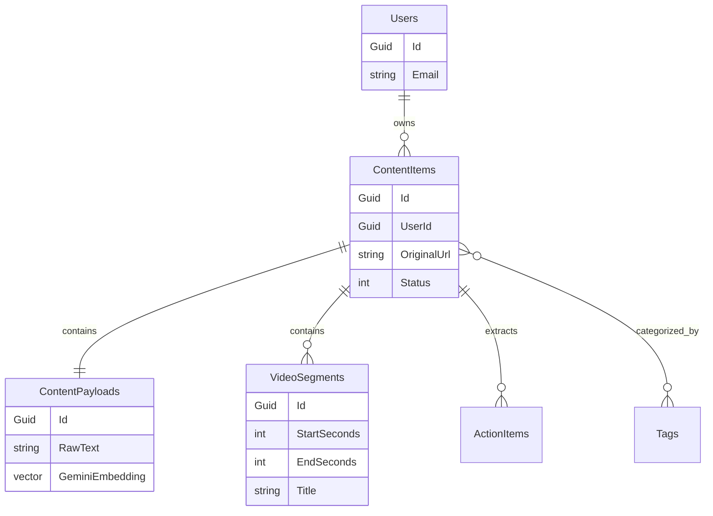

# Refind Database Documentation

The database is built on Entity Framework Core with `Npgsql.EntityFrameworkCore.PostgreSQL`. It leverages `pgvector` for storing and searching semantic embeddings generated by the LLM pipeline.

## Tables

*   **Users**: Core identity (Id, Email, PasswordHash, CreatedAt).
*   **ContentItems**: Primary item entity (Id, UserId, OriginalUrl, Title, PlatformType, Status, EnergyLevel).
*   **ContentPayloads**: Heavy data linked 1:1 to ContentItems (Id, ContentItemId, RawText, QuickSparkSummary, GeminiEmbedding). *GeminiEmbedding column uses pgvector.*
*   **VideoSegments**: Child table of ContentItems for Watch Plans (Id, ContentItemId, StartSeconds, EndSeconds, Title).
*   **ActionItems**: Extracted steps (Id, ContentItemId, Description, ItemType, SequenceOrder).
*   **Tags**: Global categorizations (Id, Name).
*   **ContentItemTags**: Join table between ContentItems and Tags.

## Entity Relationship (ER) Diagram

## AI and LLM Integration with Database

All .NET AI integration relies on `GeminiExtractionService.cs`.

### Summarization
*   **Where Invoked:** `AIExtractionWorker.ProcessContentAsync()`
*   **Why:** To generate a quick 2-sentence summary (QuickSpark) for the UI cards.
*   **Model:** `gemini-1.5-flash`
*   **Storage:** Stored in `ContentPayloads.QuickSparkSummary`.

### Embedding Generation
*   **Where Invoked:** `AIExtractionWorker.ProcessContentAsync()`
*   **Why:** To allow semantic search and Watch Plan aggregation.
*   **Model:** `text-embedding-004`
*   **Storage:** `float[]` (768 dimensions), stored in PostgreSQL `ContentPayloads.GeminiEmbedding` (vector type).

### Action Item Extraction
*   **Where Invoked:** `AIExtractionWorker.ProcessContentAsync()`
*   **Why:** To identify actionable steps within content (e.g., recipes, tutorials).
*   **Model:** `gemini-1.5-flash`
*   **Storage:** Parsed JSON mapped and stored in the `ActionItems` table.
