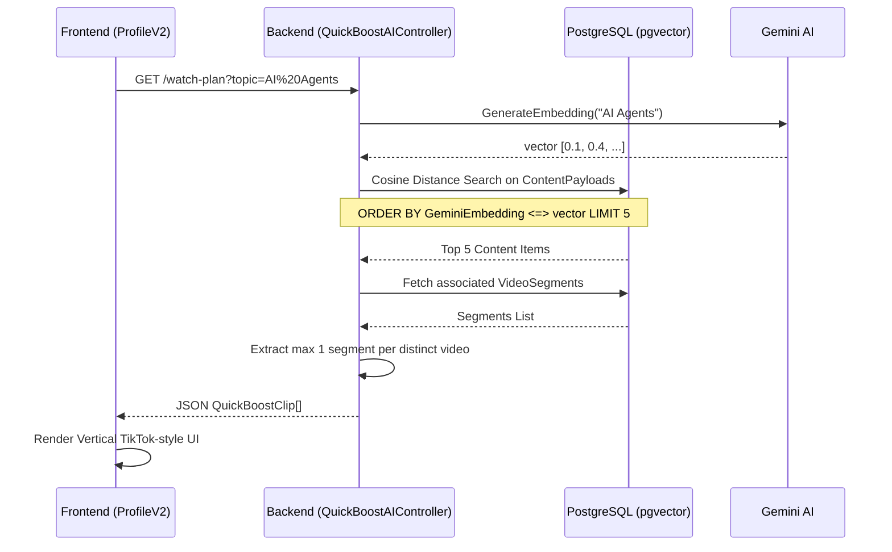
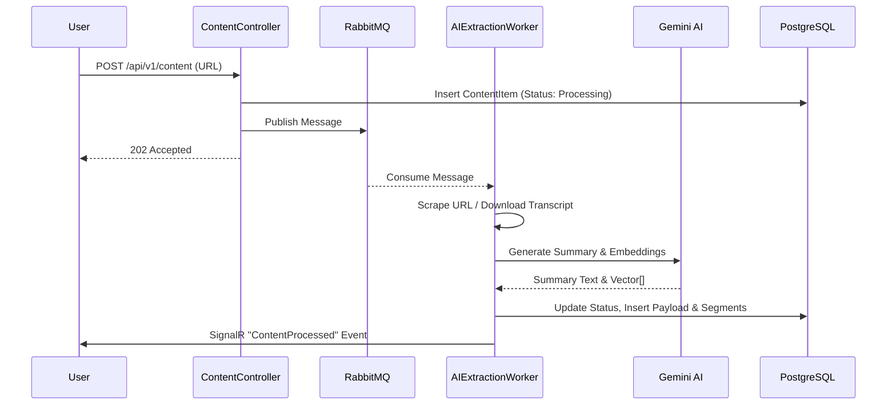

# Refind Runtime Flows

This document details the step-by-step execution flows of major features within the Refind application.

## Frontend Runtime Flow

When the user navigates to `http://localhost:5173/`, the application bootstraps and hydrates user state.

1.  **Browser loads URL** → `index.html` loads `src/main.jsx`.
2.  **Application Root Initialization**
    *   **File:** `main.jsx`
    *   **Responsibilities:** Wraps the app in `QueryClientProvider` (React Query for data fetching/caching) and `GoogleOAuthProvider`.
3.  **App & Routing Setup**
    *   **File:** `App.jsx`
    *   **Responsibilities:** Renders the `BrowserRouter`. Defines the main routes (`/`, `/login`, `/register`, `/profile`).
4.  **Authentication Hydration**
    *   **File:** `App.jsx` (uses `user` state from `AuthContext` via `localStorage`)
    *   **Responsibilities:** Checks `localStorage` for a `token`. If present, the user is considered authenticated and requests include the token in the `Authorization: Bearer <token>` header (handled in `src/api.js`). If absent, redirects to `/login`.
5.  **Dashboard Initialization**
    *   **File:** `Dashboard.jsx`
    *   **Responsibilities:** Mounts the primary layout. Calls `api.getFeed` to fetch the first page of content. Initializes SignalR WebSocket connection to `http://localhost:5183/hubs/content` to listen for asynchronous background job updates (`ContentProcessed`, `ContentFailed`).

## Backend Request Processing

### Example: Save URL Endpoint

**HTTP Method:** `POST`
**Route:** `/api/v1/content`

**Request Flow:**

1.  **API Gateway:** Request arrives at Kestrel. Middleware validates the JWT.
2.  **Controller:** `ContentController.SaveContent(SaveContentRequest)`
    *   **File:** `ContentController.cs`
    *   **Responsibilities:** Extracts `userId` from Claims. Forwards to UseCase.
3.  **UseCase:** `SaveContentUseCase.ExecuteAsync()`
    *   **File:** `ContentUseCases.cs`
    *   **Responsibilities:** 
        *   Validates URL format.
        *   Checks `_contentRepo.ExistsByUrlAsync` for duplicates.
        *   Calls `DetectPlatformType()` to identify if it's YouTube, Web, PDF, etc.
        *   Creates a `ContentItem` in PostgreSQL with `Status = Processing`.
        *   Publishes a message to RabbitMQ (`ai_extraction_queue`).
        *   Returns the `ContentItemId` immediately (HTTP 202 Accepted equivalent).

## URL Processing Logic & Background Jobs

The core strength of Refind is its automated ingestion pipeline.

**Scenario:** The user saves a YouTube URL.

**Step 1: Frontend Event**
*   User pastes URL in `SaveContentModal.jsx`. Hits Submit.
*   Calls `api.saveUrl(url)`.

**Step 2: API Request**
*   POST `/api/v1/content` is handled by `ContentController.cs`.

**Step 3: Backend Initial Validation & Persistence**
*   `SaveContentUseCase` saves a placeholder row in `ContentItems` and dispatches to RabbitMQ. Returns fast.

**Step 4: Background Processing Trigger**
*   `AIExtractionWorker.cs` consumes the message from RabbitMQ.
*   **Method:** `AIExtractionWorker.ProcessContentAsync()`

**Step 5: Content Extraction & Identification**
*   The worker uses `IContentProcessorFactory` to resolve the correct processor based on `PlatformType`.
*   For YouTube, it resolves `YouTubeProcessor`.
*   **Method:** `YouTubeProcessor.ProcessAsync()`
    *   Calls `YouTubeImportService.GetVideoDetailsAsync()` to get the video title and description.
    *   Calls `YouTubeImportService.GetTranscriptAsync()` to download the actual spoken subtitles (raw text) using `youtube-transcript-api` (via Python fallback or direct).

**Step 6: LLM Processing**
*   If content is successfully extracted, the Worker sequentially calls:
    *   `_aiService.GenerateSummaryAsync()` (LLM text summarization)
    *   `_aiService.GenerateEmbeddingAsync()` (LLM vectorization of the raw text)
    *   `_aiService.ExtractActionsAsync()` (LLM structured extraction for steps/tools)

**Step 7: Database Persistence**
*   The Worker updates PostgreSQL:
    *   Saves `ContentPayload` (Summary, RawText, Vector Embedding).
    *   Saves `ActionItem` list.
    *   Links AI-generated `Tag`s.

**Step 8: Video Segmentation (For Watch Plans)**
*   If `PlatformType == YouTube`, the worker calls the Python AI Service.
*   **Method:** `IPythonAIService.AnalyzeVideoAsync()`
*   The Python service (`ai-service/video_service.py`) uses `google.generativeai` to intelligently slice the transcript into contextual chunks (Start time, End Time, Title, Summary).
*   Saves slices to `VideoSegments` table.

**Step 9: UI Update**
*   The worker changes `ContentItem.Status` to `Completed`.
*   Broadcasts via SignalR `IHubContext<ContentHub>` to all clients subscribed to that `UserId`.
*   **Method:** `_hubContext.Clients.User(userId).SendAsync("ContentProcessed", contentItemId)`
*   Frontend receives event and invalidates React Query cache, reloading the Feed automatically.

## Sequence Diagrams

### Watch Plan / Reel Generation

### Async Content Ingestion

