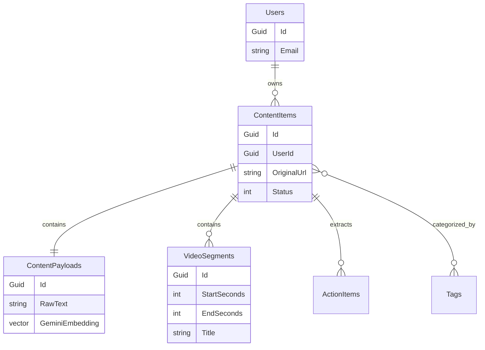
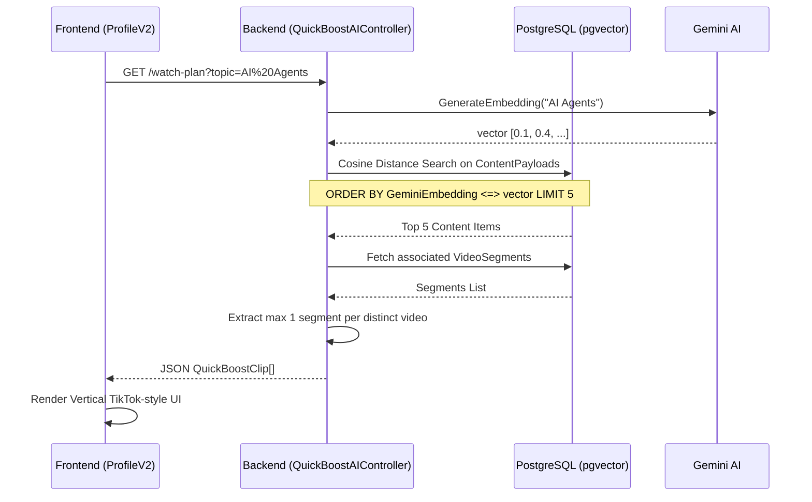
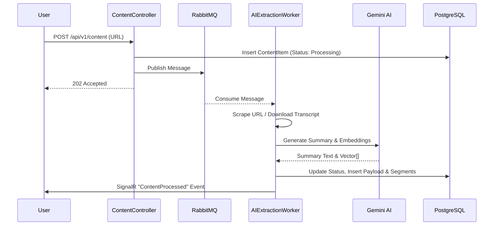

# Complete Technical Implementation Document: Refind (Digital Brain)

This document provides an exhaustive, end-to-end overview of the current technical implementation of the Refind application. It serves as an authoritative guide for architects, developers, and product owners to understand the system design, components, features, and runtime logic.

---

## 1. Overall Architecture

The application relies on a React/Vite Single Page Application (SPA) on the frontend communicating via REST and SignalR WebSockets to a C# ASP.NET Core 8 Backend using vertical slice architecture. The primary datastore is PostgreSQL with `pgvector` for embedding search, with Redis for caching and RabbitMQ for asynchronous background processing. 

A supplementary Python background service is responsible for complex video segmentation via the Gemini multimodal API.

```mermaid
graph TD
    %% Users
    User[User / Web Browser]

    %% Frontend Layer
    subgraph Frontend [React SPA (Vite)]
        UI[React Components]
        State[React Query / Context]
        Router[React Router]
    end

    %% API Gateway / Routing
    subgraph Gateway [API Layer]
        Kestrel[Kestrel Web Server]
        SignalR[SignalR Hubs]
    end

    %% Backend Monolith (Vertical Slices)
    subgraph Backend [ASP.NET Core Web API]
        AuthSlice[Auth Module]
        ContentSlice[Content Module]
        SearchSlice[Search Module]
        QuickBoostSlice[QuickBoost AI Module]
        InteractionSlice[User Interaction Module]
    end

    %% Data & Infrastructure
    subgraph Infrastructure [Data & Messaging]
        PG[(PostgreSQL + pgvector)]
        Redis[(Redis Cache)]
        RMQ>RabbitMQ Message Broker]
    end

    %% External & AI Services
    subgraph External [External Services]
        Gemini[Google Gemini API]
        PythonAI[Python Video Analyzer]
        OAuth[Google OAuth2]
    end

    %% Connections
    User -->|HTTPS| Frontend
    Frontend -->|REST / WebSocket| Gateway
    Gateway --> Backend
    Backend -->|Read/Write| PG
    Backend -->|Cache| Redis
    Backend -->|Publish/Consume| RMQ
    
    %% AI connections
    Backend -->|LLM Prompts / Embeddings| Gemini
    Backend -->|HTTP POST| PythonAI
    AuthSlice -->|Verify Token| OAuth
    
    %% Background Workers
    RMQ -->|Consume AI Tasks| AIExtractionWorker[AI Extraction Background Service]
    AIExtractionWorker -->|Generate Summaries / Actions / Tags| Gemini
    AIExtractionWorker -->|Save Results| PG
```

---

## 2. Complete Feature Inventory

### Feature: Ingest Content (Save URL)
*   **Purpose**: Allows users to save a URL to their digital brain. The system fetches the content, extracts text, categorizes it, and runs AI to summarize and extract action items.
*   **Frontend Components**: `Dashboard.jsx`, `SaveContentModal.jsx`, `api.js` (`saveUrl`)
*   **Backend Services**: `ContentController`, `SaveContentUseCase`, `AIExtractionWorker`, `ContentProcessorFactory`, `YouTubeImportService`
*   **API Endpoints**: `POST /api/v1/content`
*   **Database Tables**: `ContentItems`, `ContentPayloads`, `Tags`, `ContentItemTags`, `ActionItems`, `VideoSegments`
*   **LLM Usage**: Generates summaries, identifies relevant tags, extracts action steps, and calculates embeddings for semantic search.
*   **External Dependencies**: Google Gemini API, RabbitMQ

### Feature: Content Feed & Declutter
*   **Purpose**: Displays the ingested content to the user, allowing them to filter by energy level and platform. Users can archive, pin, or delete content.
*   **Frontend Components**: `Dashboard.jsx`, `ContentCard.jsx`, `api.js` (`getFeed`, `declutterItem`)
*   **Backend Services**: `ContentController`, `GetContentFeedUseCase`, `DeclutterContentUseCase`
*   **API Endpoints**: `GET /api/v1/content/feed`, `POST /api/v1/content/{id}/declutter`
*   **Database Tables**: `ContentItems`
*   **LLM Usage**: None directly on read.
*   **External Dependencies**: Redis (caching).

### Feature: QuickBoost Watch Plans (AI Reels)
*   **Purpose**: Automatically aggregates short, relevant video segments from the user's saved library matching a specific topic into a vertical, scrollable "Reel" format.
*   **Frontend Components**: `ProfileV2.jsx`, `QuickBoostReel.jsx`
*   **Backend Services**: `QuickBoostAIController`, `SemanticSearchUseCase`, `QuickBoostAIController` internal methods (`GetWatchPlan`)
*   **API Endpoints**: `GET /api/v1/quickboost/watch-plan`
*   **Database Tables**: `ContentPayloads`, `ContentItems`, `VideoSegments`
*   **LLM Usage**: Embeddings matching via `pgvector` (Cosine distance).
*   **External Dependencies**: YouTube Embed Iframe API.

### Feature: Semantic Search (RAG)
*   **Purpose**: Answers user questions using the user's saved knowledge base as context.
*   **Frontend Components**: `Dashboard.jsx` (Search Bar), `SearchModal.jsx`
*   **Backend Services**: `SearchController`, `RAGUseCase`, `SemanticSearchUseCase`, `AIExtractionService`
*   **API Endpoints**: `POST /api/v1/search/rag`
*   **Database Tables**: `ContentPayloads`, `ContentItems`
*   **LLM Usage**: Generates query embedding, performs vector search, and generates a conversational answer using the retrieved payloads as context.

### Feature: Authentication & Registration
*   **Purpose**: Securely authenticates users via local email/password or Google OAuth, issuing JWTs.
*   **Frontend Components**: `Login.jsx`, `Register.jsx`, `AuthProvider`
*   **Backend Services**: `AuthController`, `AuthUseCases`
*   **API Endpoints**: `POST /api/v1/auth/login`, `POST /api/v1/auth/register`, `POST /api/v1/auth/oauth`
*   **Database Tables**: `Users`, `UserIdentities`
*   **LLM Usage**: None.
*   **External Dependencies**: Google OAuth2 API.

---

## 3. Frontend Runtime Flow

When the user navigates to `http://localhost:5173/`, the application bootstraps and hydrates user state.

1.  **Browser loads URL** → `index.html` loads `src/main.jsx`.
2.  **Application Root Initialization**
    *   **File:** `main.jsx`
    *   **Responsibilities:** Wraps the app in `QueryClientProvider` (React Query for data fetching/caching) and `GoogleOAuthProvider`.
3.  **App & Routing Setup**
    *   **File:** `App.jsx`
    *   **Responsibilities:** Renders the `BrowserRouter`. Defines the main routes (`/`, `/login`, `/register`, `/profile`).
4.  **Authentication Hydration**
    *   **File:** `App.jsx` (uses `user` state from `AuthContext` via `localStorage`)
    *   **Responsibilities:** Checks `localStorage` for a `token`. If present, the user is considered authenticated and requests include the token in the `Authorization: Bearer <token>` header (handled in `src/api.js`). If absent, redirects to `/login`.
5.  **Dashboard Initialization**
    *   **File:** `Dashboard.jsx`
    *   **Responsibilities:** Mounts the primary layout. Calls `api.getFeed` to fetch the first page of content. Initializes SignalR WebSocket connection to `http://localhost:5183/hubs/content` to listen for asynchronous background job updates (`ContentProcessed`, `ContentFailed`).

---

## 4. Backend Request Processing

### Example: Save URL Endpoint

**HTTP Method:** `POST`
**Route:** `/api/v1/content`

**Request Flow:**

1.  **API Gateway:** Request arrives at Kestrel. Middleware validates the JWT.
2.  **Controller:** `ContentController.SaveContent(SaveContentRequest)`
    *   **File:** `ContentController.cs`
    *   **Responsibilities:** Extracts `userId` from Claims. Forwards to UseCase.
3.  **UseCase:** `SaveContentUseCase.ExecuteAsync()`
    *   **File:** `ContentUseCases.cs`
    *   **Responsibilities:** 
        *   Validates URL format.
        *   Checks `_contentRepo.ExistsByUrlAsync` for duplicates.
        *   Calls `DetectPlatformType()` to identify if it's YouTube, Web, PDF, etc.
        *   Creates a `ContentItem` in PostgreSQL with `Status = Processing`.
        *   Publishes a message to RabbitMQ (`ai_extraction_queue`).
        *   Returns the `ContentItemId` immediately (HTTP 202 Accepted equivalent).

**Database Tables Modified:** `ContentItems` (Insert)

---

## 5. URL Processing Logic (Most Important)

The core strength of Refind is its automated ingestion pipeline.

**Scenario:** The user saves a YouTube URL.

**Step 1: Frontend Event**
*   User pastes URL in `SaveContentModal.jsx`. Hits Submit.
*   Calls `api.saveUrl(url)`.

**Step 2: API Request**
*   POST `/api/v1/content` is handled by `ContentController.cs`.

**Step 3: Backend Initial Validation & Persistence**
*   `SaveContentUseCase` saves a placeholder row in `ContentItems` and dispatches to RabbitMQ. Returns fast.

**Step 4: Background Processing Trigger**
*   `AIExtractionWorker.cs` consumes the message from RabbitMQ.
*   **Method:** `AIExtractionWorker.ProcessContentAsync()`

**Step 5: Content Extraction & Identification**
*   The worker uses `IContentProcessorFactory` to resolve the correct processor based on `PlatformType`.
*   **File:** `ContentProcessorFactory.cs`
*   For YouTube, it resolves `YouTubeProcessor`.
*   **Method:** `YouTubeProcessor.ProcessAsync()`
    *   Calls `YouTubeImportService.GetVideoDetailsAsync()` to get the video title and description.
    *   Calls `YouTubeImportService.GetTranscriptAsync()` to download the actual spoken subtitles (raw text) using `youtube-transcript-api` (via Python fallback or direct).

**Step 6: LLM Processing**
*   If content is successfully extracted, the Worker sequentially calls:
    *   `_aiService.GenerateSummaryAsync()` (LLM text summarization)
    *   `_aiService.GenerateEmbeddingAsync()` (LLM vectorization of the raw text)
    *   `_aiService.ExtractActionsAsync()` (LLM structured extraction for steps/tools)

**Step 7: Database Persistence**
*   The Worker updates PostgreSQL:
    *   Saves `ContentPayload` (Summary, RawText, Vector Embedding).
    *   Saves `ActionItem` list.
    *   Links AI-generated `Tag`s.

**Step 8: Video Segmentation (For Watch Plans)**
*   If `PlatformType == YouTube`, the worker calls the Python AI Service.
*   **Method:** `IPythonAIService.AnalyzeVideoAsync()`
*   The Python service (`ai-service/video_service.py`) uses `google.generativeai` to intelligently slice the transcript into contextual chunks (Start time, End Time, Title, Summary).
*   Saves slices to `VideoSegments` table.

**Step 9: UI Update**
*   The worker changes `ContentItem.Status` to `Completed`.
*   Broadcasts via SignalR `IHubContext<ContentHub>` to all clients subscribed to that `UserId`.
*   **Method:** `_hubContext.Clients.User(userId).SendAsync("ContentProcessed", contentItemId)`
*   Frontend receives event and invalidates React Query cache, reloading the Feed automatically.

---

## 6. LLM and AI Processing Flow

All .NET AI integration relies on `GeminiExtractionService.cs`.

### A. Summarization
*   **Where Invoked:** `AIExtractionWorker.ProcessContentAsync()`
*   **Why:** To generate a quick 2-sentence summary (QuickSpark) for the UI cards.
*   **Model:** `gemini-1.5-flash`
*   **Prompt Template:** `"Summarize the following text in 2-3 concise sentences. Focus on the core value proposition:\n\n{text}"`
*   **Response:** Plain text.

### B. Embedding Generation
*   **Where Invoked:** `AIExtractionWorker.ProcessContentAsync()`
*   **Why:** To allow semantic search and Watch Plan aggregation.
*   **Model:** `text-embedding-004`
*   **Prompt Template:** No prompt, strictly API payload.
*   **Response:** `float[]` (768 dimensions), stored in PostgreSQL `vector` type.

### C. Action Item Extraction
*   **Where Invoked:** `AIExtractionWorker.ProcessContentAsync()`
*   **Why:** To identify actionable steps within content (e.g., recipes, tutorials).
*   **Model:** `gemini-1.5-flash`
*   **Prompt Template:** `"Analyze the text. Extract key action items or steps. Return JSON... Format: [{'Description': '...', 'Type': 'Tool/Instruction', 'Order': 1}]"`
*   **Response:** Parsed JSON mapped to `List<ActionItem>`.

### D. Conversational RAG
*   **Where Invoked:** `RAGUseCase.ExecuteAsync()`
*   **Why:** Answer a direct query from the user in the search modal.
*   **Model:** `gemini-1.5-flash`
*   **Prompt Template:** `"Answer the user's question using ONLY the provided context...\n\nContext:\n{context}\n\nQuestion: {query}"`
*   **Response:** Plain text.

---

## 7. Database Mapping

The database is built on EF Core with `Npgsql.EntityFrameworkCore.PostgreSQL`.

### Tables

*   **Users**: Core identity (Id, Email, PasswordHash, CreatedAt).
*   **ContentItems**: Primary item entity (Id, UserId, OriginalUrl, Title, PlatformType, Status, EnergyLevel).
*   **ContentPayloads**: Heavy data linked 1:1 to ContentItems (Id, ContentItemId, RawText, QuickSparkSummary, GeminiEmbedding). *GeminiEmbedding column uses pgvector.*
*   **VideoSegments**: Child table of ContentItems for Watch Plans (Id, ContentItemId, StartSeconds, EndSeconds, Title).
*   **ActionItems**: Extracted steps (Id, ContentItemId, Description, ItemType, SequenceOrder).
*   **Tags**: Global categorizations (Id, Name).
*   **ContentItemTags**: Join table between ContentItems and Tags.

### ER Diagram



---

## 8. Background Processing

**1. AIExtractionWorker (Hosted Service)**
*   **Trigger:** Message published to RabbitMQ `ai_extraction_queue`.
*   **Execution Flow:** Detailed in Section 5.
*   **Dependencies:** RabbitMQ, PostgreSQL, Gemini API.
*   **Failure Handling:** Dead-letter queue mechanism. If processing fails, exception is logged, message is `Nack`ed and pushed to `ai_extraction_dlx` for retry or debugging.

**2. Python Video Service (ai-service/video_service.py)**
*   **Trigger:** HTTP POST request from `.NET AIExtractionWorker` at Step 5.5.
*   **Execution Flow:** Uses `google.generativeai` and PyTube/YoutubeTranscriptAPI to analyze chunks of the transcript against timestamps. Returns JSON payload.

---

## 9. API to Database Traceability Matrix

| API Endpoint | Service/UseCase | Repository | Tables Read | Tables Written | LLM Usage |
| :--- | :--- | :--- | :--- | :--- | :--- |
| **POST /api/v1/content** | `SaveContentUseCase` | `ContentItemRepository` | `ContentItems` (Check) | `ContentItems` | No |
| **GET /api/v1/content/feed** | `GetContentFeedUseCase` | `ContentItemRepository` | `ContentItems`, `Tags` | None | No |
| **DELETE /api/v1/content/{id}** | `DeleteContentUseCase` | `ContentItemRepository` | `ContentItems` | `ContentItems` (Cascades) | No |
| **POST /api/v1/search/rag** | `RAGUseCase`, `SemanticSearch`| `ContentPayloadRepository` | `ContentPayloads`, `Items` | None | Yes (Embed, Chat) |
| **GET /api/v1/quickboost/watch-plan** | `SemanticSearchUseCase` | `ContentPayloadRepository` | `ContentPayloads`, `Segments`| None | Yes (Embed) |

---

## 10. Sequence Diagrams

### Watch Plan / Reel Generation



### Async Content Ingestion


